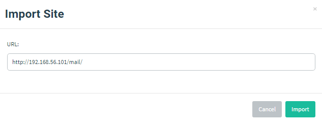
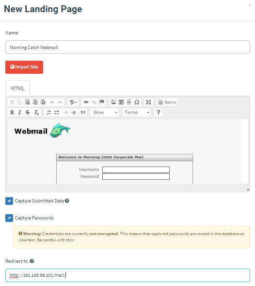

# 创建演练落地页

Morning Catch 公司有一个 Webmail 门户；本例将其克隆为演练落地页。

进入 “Landing Pages” 页面，点击 “New Page”。

要通过 URL 导入站点，点击 “Import Site”。Webmail 门户位于 `/mail/`，因此本例使用 `http://192.168.56.101/mail/` 作为导入 URL。

导入后，HTML 会填入编辑器。点击 “Source” 按钮可预览页面。

原始指南最后会同时勾选数据采集和密码采集选项，并在用户提交凭据后重定向到 Webmail 门户。

::: warning

本项目不启用真实密码采集。落地页仅记录已批准的最小化提交事件，并按演练授权范围配置重定向。

:::

最后点击 “Save Page” 保存落地页。
