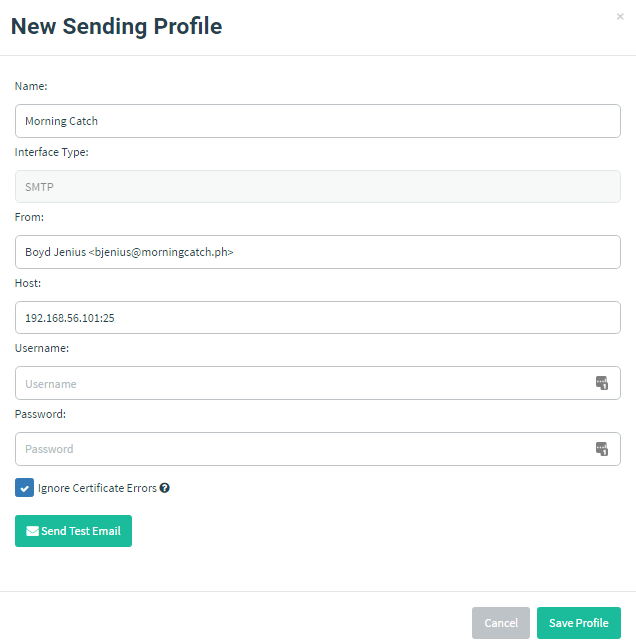

# 创建发送配置

为本例演练活动创建发送配置很简单：进入 “Sending Profiles” 页面，点击 “New Profile”。

本例中，邮件由系统管理员 Boyd Jenius 发出，因此在 “From” 字段填写其姓名和邮箱地址。

Morning Catch 虚拟机在 `192.168.56.101:25` 监听入站邮件，因此在 “Host” 中使用该地址。

> 请记住：配置发送配置时**始终**要指定端口号。“Host” 必须使用 `host:port` 格式。

配置完成后应类似于下图：

如有需要，可向 `morningcatch.ph` 域中的另一名收件人发送测试邮件，确认邮件中继是否正常。

设置完成后，点击 “Save Profile”。
