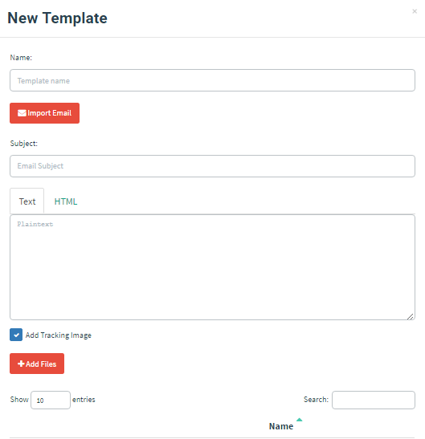
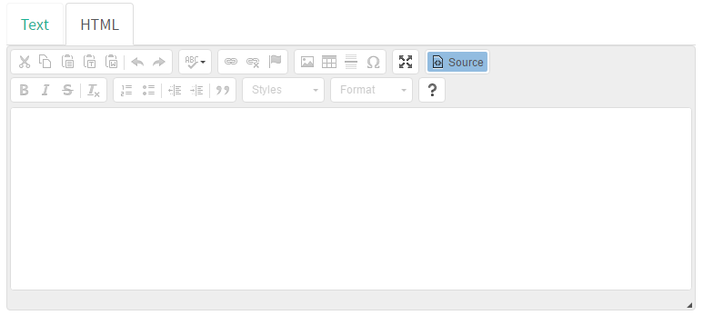
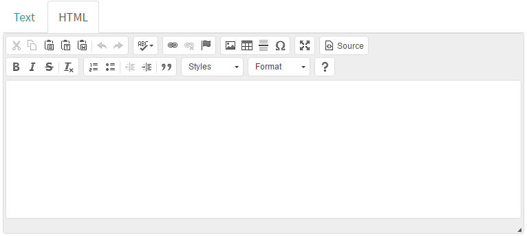
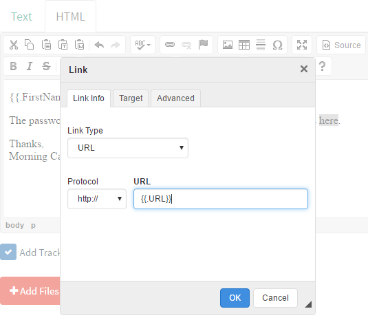

# 创建模板

要创建 Morning Catch 演练活动使用的模板，先进入 “Email Templates” 页面，点击 “New Template”。



Morning Catch 提供 Webmail 门户。本例创建一封提示用户重设密码的简单模板。该场景仅用于演示；使用 “Import Email” 功能可直接将现有邮件导入 GoPhish，以获得更贴近真实环境的效果。

邮件主题如下：

```text
Password Reset for {{.Email}}
```

这里使用了 `{{.Email}}` 模板变量。发送邮件时，它会替换为目标对象的邮箱地址；GoPhish 通过这种方式为每名目标对象定制邮件。

点击 “HTML” 标签可打开用于创建 HTML 内容的编辑器：



本例内容较简单，点击 “Source” 按钮，切换到可视化编辑器即可：



为演示起见，模板消息如下：

```text
{{.FirstName}},

The password for {{.Email}} has expired. Please reset your password here.

Thanks,
Morning Catch IT Team
```

接下来添加钓鱼链接：选中 “here”，点击菜单中的链条图标以打开 “Link” 对话框。在其中将链接设为另一个模板变量 `{{.URL}}`，这样链接会自动生成并插入邮件。



最后确认已勾选 “Add Tracking Image”，再点击 “Save Template”。
