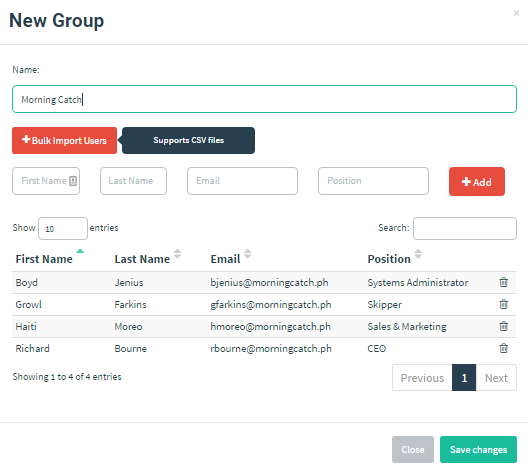

# 导入用户组

启动演练活动前，首先要确定目标对象。潜在目标邮箱地址的收集或生成方式很多；若要模拟真实场景，原始指南提到可通过公开信息和 OSINT 收集邮箱地址。

::: warning

本项目仅使用已获授权范围内的收件人名单。不得在未授权情况下收集、导入或使用个人邮箱信息。

:::

已有用户列表后，将其导入 GoPhish。

进入 “Users & Groups”，点击 “New Group”：


本例针对 Morning Catch 演练，可将用户组命名为 “Morning Catch Employees”。

添加成员有两种方式：

- 通过表单逐一填写成员信息；
- 从 CSV 文件批量导入用户组。

为节省时间，本例使用 CSV。

## 从 CSV 导入

GoPhish 要求 CSV 包含以下表头：

- First Name
- Last Name
- Email
- Position

Morning Catch 的 CSV 如下：

```text
First Name,Last Name,Position,Email
Richard,Bourne,CEO,rbourne@morningcatch.ph
Boyd,Jenius,Systems Administrator,bjenius@morningcatch.ph
Haiti,Moreo,Sales & Marketing,hmoreo@morningcatch.ph
```

使用 “Bulk Import Users” 上传 CSV 后，成员会自动添加：



点击 “Save changes” 后，会显示用户组已创建的确认信息。

> 提示：若未立即看到用户组，刷新页面后应会显示在表格中。
