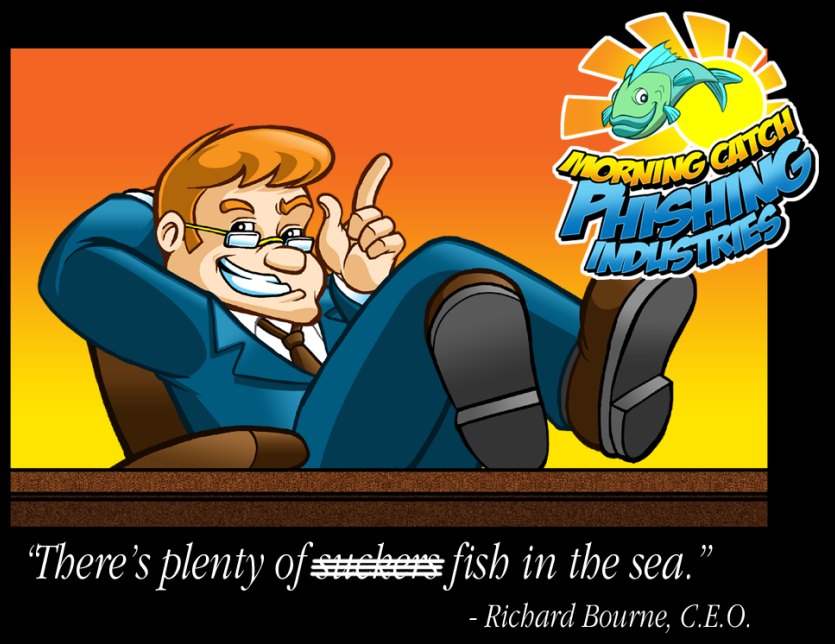

# 介绍 Morning Catch 公司

本指南将以一家名为 Morning Catch 的虚构公司为例，逐步演示如何从头设置用户、模板以及完整的演练活动。这里假定我们担任 Morning Catch 的安全管理员，并已获得开展此培训的授权。

这家虚构公司基于一个专门用于测试钓鱼框架的优秀虚拟机；如有兴趣，可在[此处](http://blog.cobaltstrike.com/2014/08/06/introducing-morning-catch-a-phishing-paradise/)下载。

该虚构公司包含三名用户：Richard Bourne、Boyd Jenius 和 Haiti Moreo。
