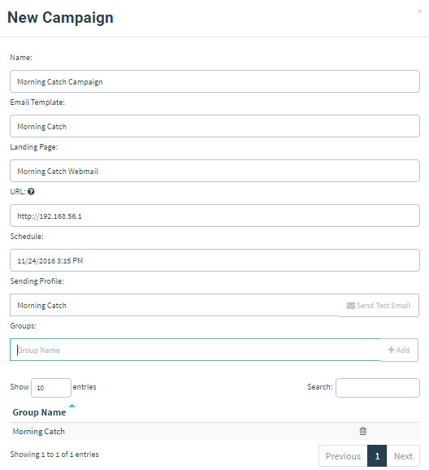
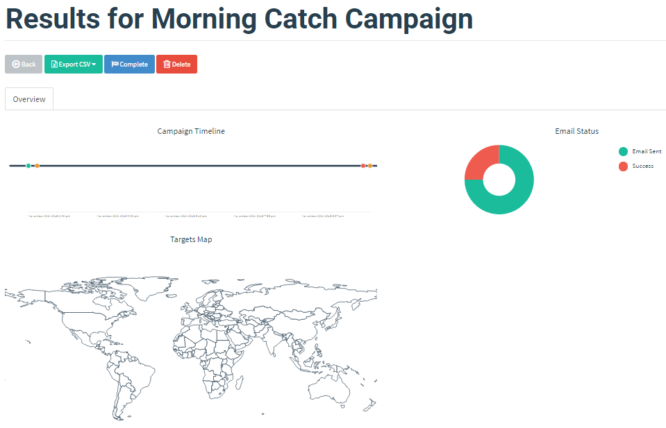

# 启动演练活动

所有组件配置完成后，即可启动演练活动。

进入 “Campaigns” 页面，点击 “New Campaign” 创建新活动。

大部分设置不言自明；需要特别注意的是 `URL` 字段。本例中 GoPhish 服务器 IP 为 `192.168.1.1`，因此使用该地址：

填写全部设置后，点击 “Launch Campaign” 开始发送邮件。

## 查看结果

活动启动后，会自动跳转到活动结果页面，可实时查看邮件发送、打开和链接点击情况。

至此，你已完成第一场演练活动。
