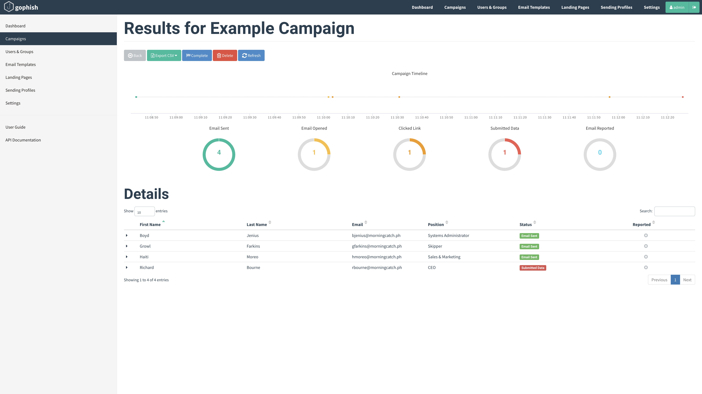
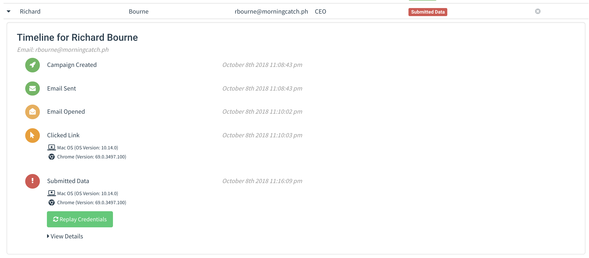

# 演练活动

GoPhish 的核心是启动演练活动：向一个或多个用户组发送邮件，并记录邮件打开、链接点击或数据提交等事件。

## 启动演练活动

在导航侧栏点击 “Campaigns”，即可配置并启动演练活动。


创建演练活动需要填写以下字段：

- **Name**：演练活动名称。
- **Email Template**：发送给收件人的邮件，在[邮件模板](templates.md)中创建。
- **Landing Page**：收件人点击邮件模板链接后返回的 HTML，即**演练落地页（Landing Page）**；在[落地页](landing-pages.md)中创建。
- **URL**：用于填充 `{{.URL}}` 模板变量的 URL。它应指向 GoPhish 钓鱼服务器，且收件人能够访问。
- **Launch Date**：开始日期；详见下文的活动排程。
- **Send Emails By**：所有邮件应在此日期前发完；详见下文的活动排程。
- **Sending Profile**：发送邮件使用的 SMTP 配置，在[发送配置](sending-profiles.md)中创建。
- **Groups**：指定应纳入活动的收件人用户组。

### 为演练活动排程

GoPhish 支持预先排程。需要关注 **Launch Date** 和 **Send Emails By** 两个字段。

**Launch Date** 表示 GoPhish 开始发送邮件的时间；默认会立即启动活动。

默认情况下，GoPhish 会在启动后尽快发送全部邮件。若希望将邮件分散到一段时间内发送，可设置 **Send Emails By**；GoPhish 会在启动日期和该日期之间均匀安排邮件发送。

### 启动活动

配置完成后，点击 “Launch Campaign” 并确认。GoPhish 会根据排程立即启动，或安排在之后的日期启动。

## 查看活动结果

活动启动后，会自动跳转至活动结果页面：



该页面会显示活动状态概览，以及每个目标对象的详细结果。

### 导出活动结果

点击 “Export CSV”，选择需要导出的结果类型：

- **Results**：活动中每个目标对象的当前状态，包含：

  ```text
  id, email, first_name, last_name, position, status, ip, latitude, longitude
  ```

- **Raw Events**：活动期间按发生顺序记录的事件流。

### 完成活动

点击 “Complete”，并确认将活动标记为已完成。

### 删除活动

点击 “Delete”，并确认删除活动。

> 注：此操作**无法撤销**；删除活动时请谨慎。

### 查看结果详情

GoPhish 可将活动结果以时间线形式展示。展开收件人所在行，即可查看该收件人的时间线。



结果面板会显示收件人的操作，例如打开邮件、点击链接，或尝试从落地页提交数据。

GoPhish 还会记录点击链接或提交数据的设备信息。它会解析浏览器 User-Agent 字符串，并在事件详情下显示操作系统和浏览器版本。

#### 查看已采集凭据

如果创建落地页时选中了 “Capture Credentials”，GoPhish 会在结果面板中显示凭据。点击 “View Details” 下拉菜单，即可在表格中查看已采集的凭据。

::: warning

本项目不启用真实密码采集；此处仅说明官方界面的原始功能。

:::
