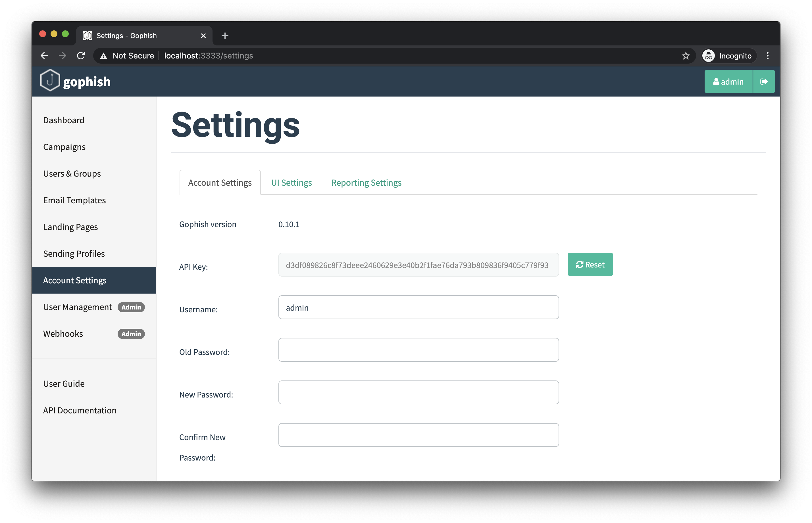

# 更改账户设置

## 修改密码与更新设置

点击 “Settings” 标签可进入设置页面。在此可修改密码，并更新 API 密钥。

修改密码时，填写当前密码和希望使用的新密码，再点击 “Save”。页面会提示发生的任何错误。

此页面还支持重置 API 密钥。点击现有 API 密钥旁的 “Reset” 即可重置。

重置后可能需要刷新页面，才能继续使用 GoPhish；官方说明该问题将会修复。
