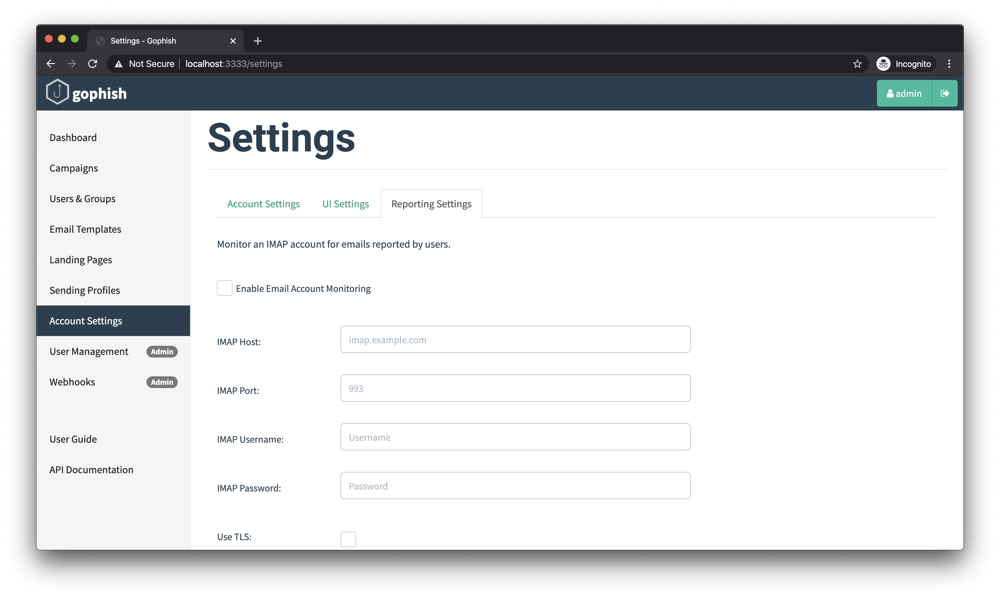
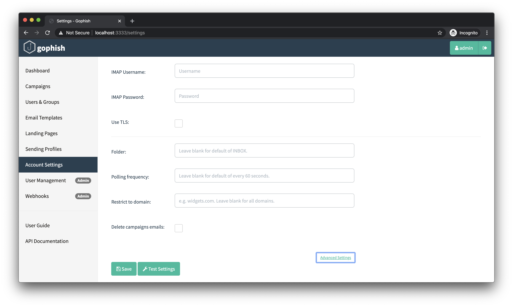

# 邮件报告

GoPhish 支持用户报告收到的模拟钓鱼邮件，以鼓励用户向管理员报告可疑邮件，从而可能更早发现恶意邮件。

目前，该功能仅支持服务器端。虽然尚未提供协助报告的邮件客户端扩展或加载项，但从 v0.9.0 起支持通过 IMAP 报告邮件。

## 邮件报告的重要性

开展钓鱼模拟时，人们常只关注有多少用户点击链接、向仿冒页面提交凭据。但关注谁向管理员报告了邮件同样重要，甚至更有价值。

例如，向 100 人发送模拟钓鱼邮件，可能出现两种情况：

- **结果 1**：仅 1 人点击链接并提交数据，看似很好；但没人报告邮件。若是真实攻击，攻击者已获得有效凭据，而管理员对此毫无察觉。
- **结果 2**：50 人点击链接，但有 1 人报告。虽然点击者更多，但管理员已知道钓鱼活动正在发生，可以启动事件响应流程。

报告可疑邮件有助于减少钓鱼攻击的影响。建议建立**奖励报告邮件的用户**的文化；即使只是向员工及其经理发送感谢邮件，也能形成正向反馈，鼓励日后继续报告。

## 通过 IMAP 报告

组织常会创建类似 `security@example.com` 的邮箱，并鼓励员工转发可疑邮件。这有助于建立员工与安全团队的协作关系。

从 v0.9.0 起，GoPhish 可通过 IMAP 检查已配置邮箱中被报告的演练活动邮件。发现活动邮件后，对应结果会更新为用户已报告该邮件。

每个 GoPhish 用户都可配置自己的 IMAP 设置，入口为 “Account Settings > Reporting Settings”。



常用设置包括 IMAP 主机名、端口、用户名和密码。通常需要启用 TLS，但应与邮件服务商确认。

### 高级设置

高级设置可指定活动邮件所在文件夹、GoPhish 轮询新结果的频率，以及是否只处理由组织域名地址报告的邮件。还可选择在邮件被报告后删除该活动邮件。



配置 IMAP 后，可保存设置，或点击 “Test Settings” 确认 GoPhish 能建立 IMAP 连接。

## GoPhish 中的报告机制

GoPhish 发送的每封邮件都包含指向该演练活动[落地页](landing-pages.md)的链接，例如：

```text
http://phish_server/?rid=1234567
```

`rid` 参数标识该链接为哪位收件人生成。要报告 GoPhish 发送的邮件，需要向以下地址发出 HTTP 请求：

```text
http://phish_server/report?rid=1234567
```

这一 HTTP 请求通常由邮件客户端扩展发出。官方当时仍在开发此类扩展；如有兴趣，可在 [GitHub 提交 issue](https://github.com/gophish/gophish/issues)。
