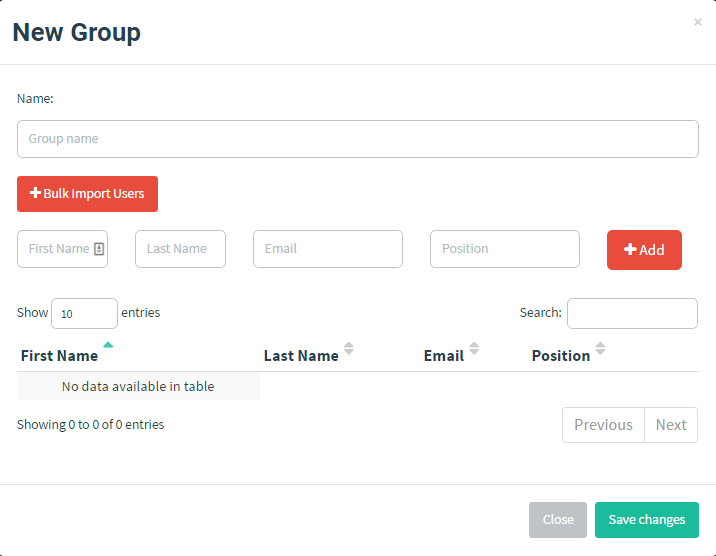

# 用户组

GoPhish 用于管理演练活动中面向的用户组。

## 创建用户组

在导航菜单中进入 “Users & Groups” 页面，点击  按钮。

随后会显示以下对话框：

创建用户组时，需要提供一个**唯一**的用户组名称，以及至少一名收件人。

### 向用户组添加用户

可以通过以下两种方式向用户组添加用户。

#### 手动添加用户

填写 “First Name”、“Last Name”、“Email” 和 “Position” 文本框，然后点击 “Add”。

#### 批量上传用户

如果逐个添加用户不方便，GoPhish 支持从 CSV 文件批量上传用户。

GoPhish 要求 CSV 包含以下表头：

- First Name
- Last Name
- Email
- Position

点击 “Bulk Import Users”，选择要上传的 CSV 文件。上传完成后，用户会显示在对话框中。

点击 “Save changes” 保存用户组。
