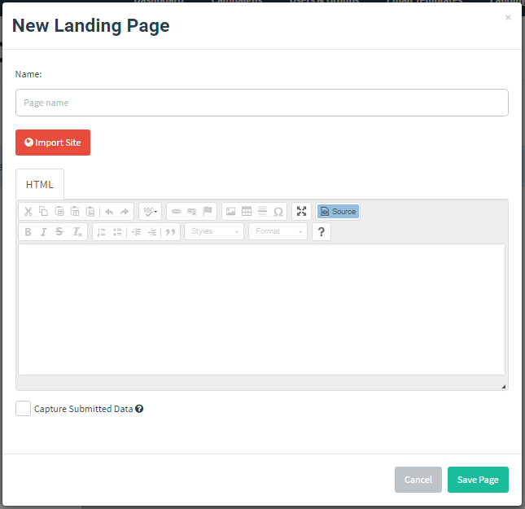
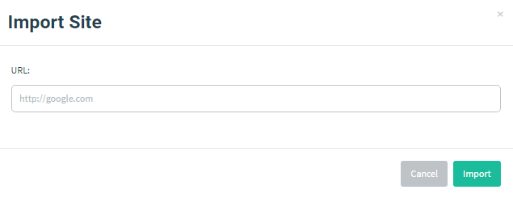

# 落地页

落地页是用户点击收到的钓鱼链接后，GoPhish 返回的实际 HTML 页面。

落地页支持模板变量、提交数据采集，以及在用户提交数据后重定向至其他网站。

> 注：落地页存储在数据库中。GoPhish 会为演练活动中的每个收件人生成唯一 ID（即 `rid` 参数），并用它动态加载正确的落地页。
>
> 若要预览落地页，可使用下方的 HTML 编辑器，或启动测试演练活动。直接访问未带 `rid` 参数的 GoPhish 监听地址会显示通用 404 页面。

在侧栏点击 “Landing Pages”，再点击 “New Page”，即可创建落地页。

落地页对话框使用与“模板”页面相同的 HTML WYSIWYG 编辑器。

## 从 URL 导入站点

GoPhish 支持从 URL 导入站点。点击 “Import Site”，输入 URL 后点击 “Import”，该 URL 的 HTML 会填入编辑器。

## 采集凭据

GoPhish 可通过落地页采集提交的数据；选择 “Capture Submitted Data” 复选框即可启用。

::: warning

官方文档说明凭据以**明文**存储；不选择 “Capture Passwords” 时，仍可采集用户名等其他文本字段。本项目不启用真实密码采集，仅记录经过批准的最小化提交事件。

:::

### 重定向用户

为避免用户提交数据后产生疑虑，可将其重定向到原始 URL。启用 “Capture Submitted Data” 后，在出现的 “Redirect To:” 文本框中输入目标 URL。

> 注：必须填写完整 URL（包括 `http://` 或 `https://`）。否则浏览器可能将其解释为相对于 GoPhish URL 的地址。

## 静态资源

若需使用 HTML、CSS/JS 或其他静态文件，请将其放到 `static/endpoint` 目录。随后可通过 `http[s]://phishing_server/static/filename` 引用。更多背景请参阅[此 issue](https://github.com/gophish/gophish/issues/220)。
