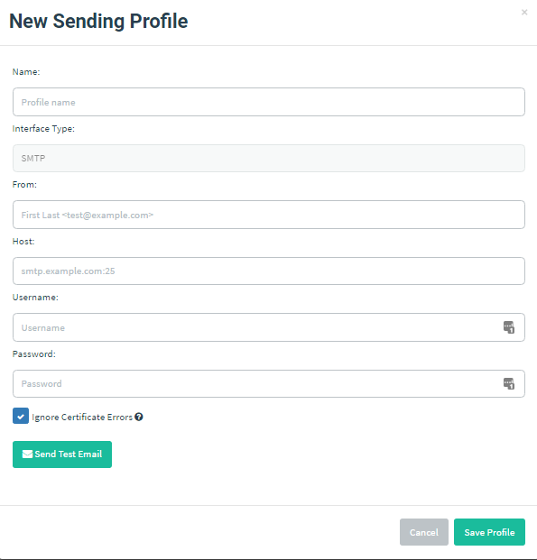
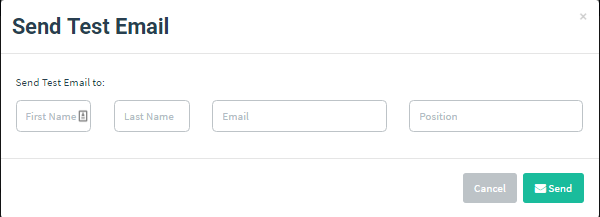

# 发送配置

要发送邮件，需在 GoPhish 中配置 SMTP 中继信息；这类配置称为“发送配置（Sending Profile）”。

在侧栏点击 “Sending Profiles”，再点击 “New Profile”，即可创建发送配置。

> 注：如果需要用于测试的 SMTP 服务器，可参考 [MailHog](https://github.com/mailhog/MailHog)。

请确保 “From” 填写的是格式有效的电子邮件地址。

“Host” 应完整填写为 `host:port` 格式。

要测试 SMTP 配置，可点击 “Send Test Email”：

填写收件人信息并点击 “Send” 后，界面会显示邮件是否发送成功。
