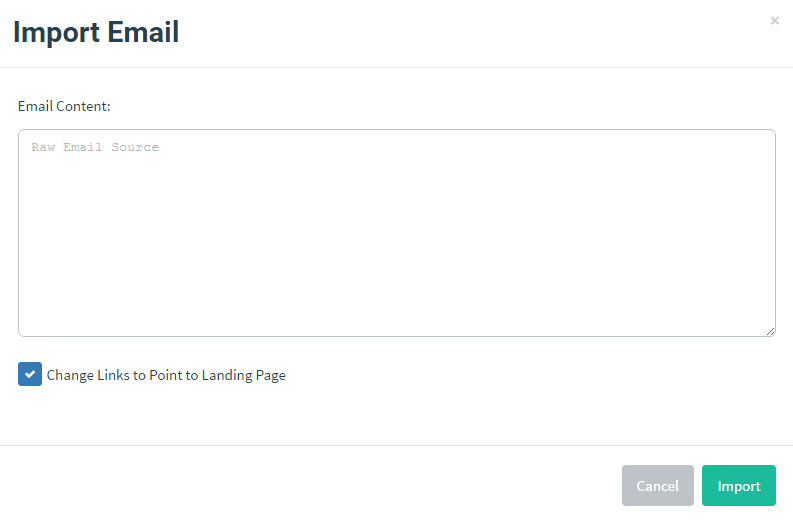

# 邮件模板

“模板”是发送给目标对象的邮件内容。它可以从现有邮件导入，也可以从头创建，并支持添加附件。

此外，模板可以包含追踪图片，以便 GoPhish 判断用户何时打开邮件。

## 创建模板

进入 “Email Templates” 页面，点击 “New Template”。

### 使用 HTML 编辑器

GoPhish 的 HTML 编辑器是一个重要功能。点击 “Source” 按钮，可在 HTML 源代码与可视化视图之间切换。

这有助于确保用户收到的邮件在视觉呈现上与预期一致。

### 导入邮件

GoPhish 支持从原始邮件内容导入邮件。点击 “Import Email”，再粘贴原始邮件内容即可。许多邮件客户端的 “View Original” 功能可查看此内容：

