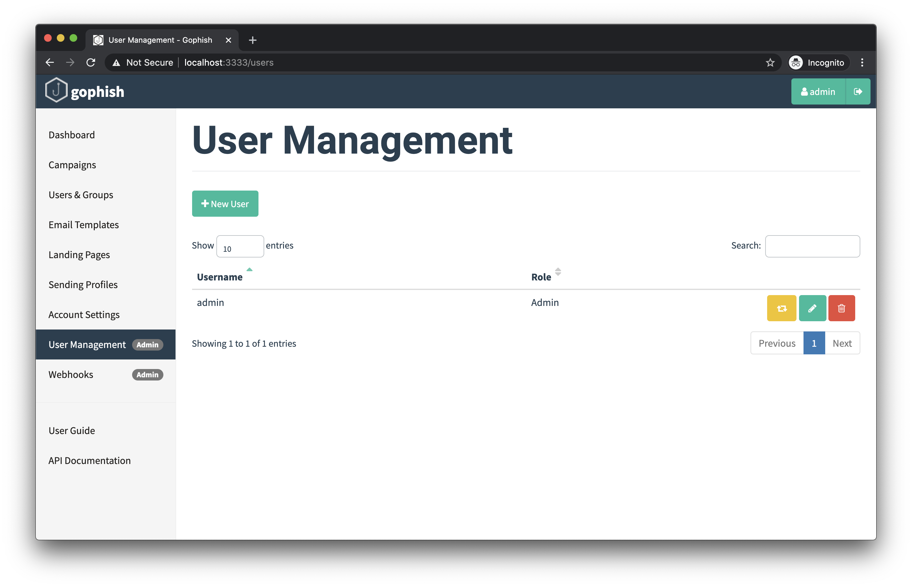
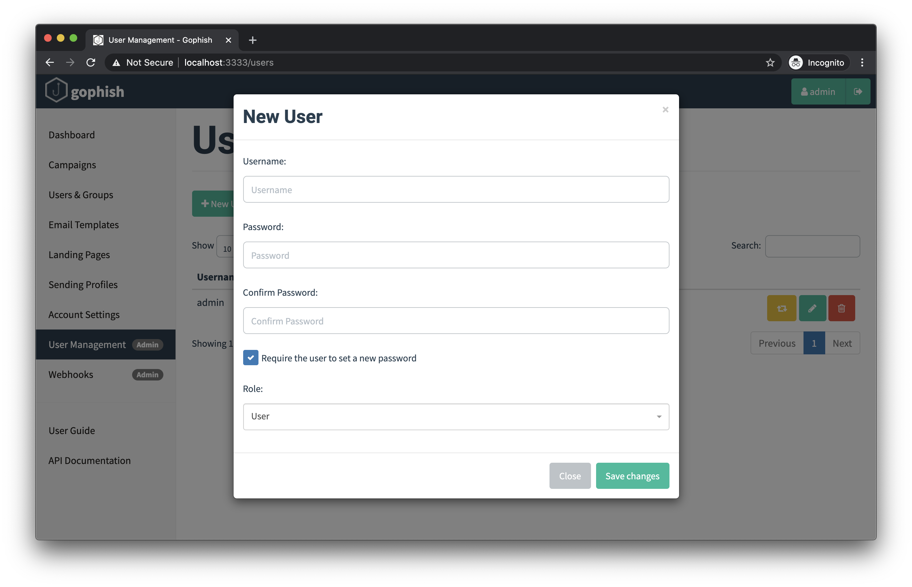

# 用户管理

GoPhish 支持具有不同角色的用户账户。目前可为用户分配两种角色：

- **User**：除管理用户、管理 Webhook 等系统级管理任务外，可执行其他操作。
- **Admin**：系统级管理员角色，拥有管理整个 GoPhish 安装实例的完整权限。

要注册新用户或管理现有用户，请以管理员用户登录并进入 “User Management” 页面：

## 注册新用户

点击 “+ New User” 按钮，会显示以下对话框：

可在此表单中设置用户名、密码、角色，以及用户首次登录时是否必须重设密码。

## 删除用户

要删除用户，点击用户列表中该用户名旁的红色垃圾桶图标。

::: info

系统始终至少需要一名具有 “Admin” 角色的用户。若尝试删除最后一名管理员用户，GoPhish 会返回错误。

:::

## 模拟用户身份

当某个 GoPhish 用户遇到问题并需要协助排障时，管理员可以“模拟”该用户。

点击用户列表中用户名旁的黄色按钮后，系统会自动以该用户的会话登录；管理员可代表该用户与 GoPhish 交互。

要返回管理员会话，需要退出登录，再使用管理员凭据重新登录。
