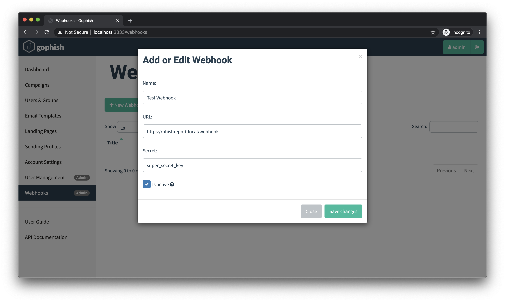

# Webhooks

GoPhish 一直支持通过 API 获取演练活动结果；但有时也希望在活动发生更新时，直接接收推送。

为此，从 v0.9.0 起 GoPhish 支持 Webhook。

配置 Webhook 后，GoPhish 会向你控制的端点发出 HTTP 请求（可选签名）。请求包含刚发生事件的 JSON 请求体，与通常通过 API 获取的 JSON 完全相同，因此可实时接收活动更新。

GoPhish 支持多个 Webhook。只有 Admin 角色用户可以在侧栏进入 “Webhooks” 并点击 “New Webhook” 创建它们。



### 验证签名

GoPhish 可使用可选密钥对每个 Webhook 签名。签名使用 HMAC-SHA256 算法，对整个 HTTP 请求的 JSON 请求体计算；GitHub、Twitter、Twilio 等也使用这种通用做法。

签名通过 `X-Gophish-Signature` 请求头发送，例如：

```text
POST /webhook HTTP/1.1
Host: localhost:9999
Accept-Encoding: gzip
Content-Length: 226
Content-Type: application/json
User-Agent: Go-http-client/1.1
X-Gophish-Signature: sha256=2be52d4b83eb7f19b0ecc75ebd6441cefea5512443eb18d38a8beb2e7584a66c
```

强烈建议设置高强度密钥，并验证 Webhook 签名，确保事件确实来自你的 GoPhish 实例。

### 事件格式

每个事件具有以下格式：

```text
{
    "email": "foo.bar@example.com",
    "time": "2020-01-20T17:33:55.553906Z",
    "message": "Email Opened",
    "details": ""
}
```

支持的 `message` 值如下：

| 消息 | 说明 |
| :--- | :--- |
| Error Sending Email | GoPhish 无法向收件人发送邮件 |
| Email Sent | 邮件已成功发送给收件人 |
| Email Opened | 收件人打开了邮件 |
| Clicked Link | 收件人点击了邮件中的链接 |
| Submitted Data | 收件人向落地页提交了数据 |
| Email Reported | 收件人[报告](email-reporting.md)了演练活动邮件 🎉 |

“Email Opened”、“Clicked Link” 和 “Submitted Data” 事件还会包含 `details` 字段，其格式如下：

```text
"payload": {
    "rid": "1234567",
    "browser": {
        "address": "127.0.0.1",
        "user-agent": "Mozilla/5.0 (...)"
    },
    "foo": ["bar"]
}
```

其中 `foo` 是提交到落地页的数据。每个表单元素都有自己的键和值列表，具体取决于落地页格式。

### 示例服务器

官方开源了一个用于接收、验证和解析 GoPhish Webhook 消息的[示例服务器](https://github.com/gophish/webhook)。由于 GoPhish 使用其他 Webhook 提供商常见的签名模式，大多数库都可配合使用。
