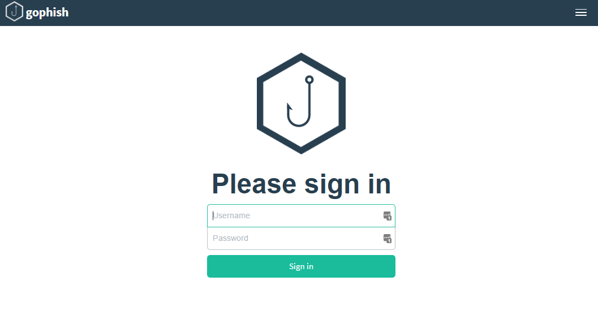

# 入门

## 运行 GoPhish

安装 GoPhish 后即可运行。打开命令行，进入 GoPhish 二进制文件所在目录，然后执行该二进制文件。

启动输出会显示管理 Web 服务器、钓鱼 Web 服务器和数据库的初始化情况，并给出访问 Web 界面所需的端口号。

如果使用的是高于 v0.10.1 的版本，首次执行时日志会打印临时管理员凭据，可用于登录。

::: info

若钓鱼服务器配置为使用 TCP 80 端口，可能需要以管理员权限运行 GoPhish，才能绑定该特权端口。

:::

## 登录

GoPhish 启动后，在浏览器访问 [https://127.0.0.1:3333](https://127.0.0.1:3333) 即可进入登录页。

对于高于 0.10.1 的版本，首次运行时的临时管理员凭据会打印在日志中。请通过受控日志读取，首次登录后立即修改密码，且不要将凭据保存到本文档或仓库。

高于 0.10.1 的版本会要求首次登录后重设密码。

::: info

若使用高于 v0.10.1 的版本且需要设置初始管理员密码，可设置 `GOPHISH_INITIAL_ADMIN_PASSWORD` 环境变量。首次登录后仍需修改密码。

:::
